# 使用必读 #
在正式开始使用CodeMonkey之前，让我们首先来了解一些基本内容。 
## 切换语言 ##
CodeMonkey支持多语言，在打开网站后，如果默认使用的不是中文，你可以通过右上角的菜单按钮来更改语言选项，如下图所示。 

 建议设置英文为默认语言，因为据我观察，尽管大部分内容都做了汉化，但有些翻译反而会让人越看越糊涂。 
## 修改头像 ##
 你可以设置自己喜欢的头像，同样是先点击右上角的菜单按钮，然后选择“我的账号”。在打开的页面，单击左侧的你的头像进行修改。 

## 浏览所有课程 ##
通过右上角的菜单按钮，选择其中的“主页”，你可以前往你的主页。在这里，你能看到所有的活动（Activity），你自己创建的挑战（Challenge）与游戏（Game），以及在学习过程中你所取得的徽章（Achievement）。 
在此有必要对“游戏”与“挑战”这两个字眼进行一下区分说明。 
在CodeMonkey网站上，一项课程（Course）往往由几个活动（Activity）组成。你可以认为将一门大课程（Course）分解成了若干门小课程，每一门小课程即为一个活动（Activity）。 
而挑战（Challenge），它专门被用来指代“编程探险 (Coding adventure)”这门课程中的关卡，看到“挑战（Challenge）”字眼，你想到这门课程就行了。 
“游戏（Game）”则是指“游戏生成器 (Game builder)”这门课程中你自己创建的游戏。 
以上内容你有个印象就行，不必深究。 
当前CodeMonkey网站上一共有如下6门课程（Course）： 
* 编程探险 (Coding adventure)
* 渡渡鸟数学营 (Dodo does math)
* 挑战生成器 (Challenge builder)
* 游戏生成器 (Game builder)
* 香蕉大探险 (Banana tales)
* 聊天机器人编程 (Coding chatbots)
### 编程探险 (Coding adventure)
编程探险这一门课程(Course)，由以下几项活动(Activity)组成。 
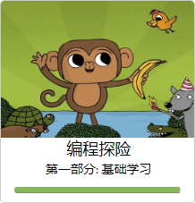 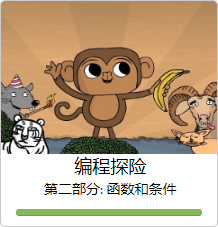 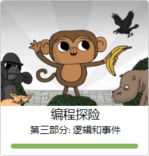 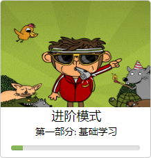 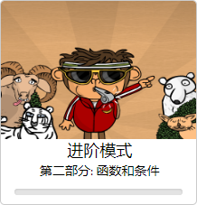 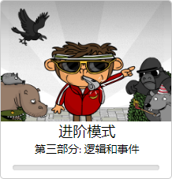 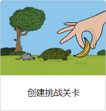 
这一系列课程也就是大众最为熟知的小猴子捡香蕉的游戏。 
小猴子抢回香蕉的故事情节充满趣味，游戏设计把编程知识融入其中，其内容充满挑战性，很容易培养儿童对编程的兴趣。 
这一系列课程采用的编程教学语言是CoffeeScript，这是JavaScript的一种转译语言，执行效率非常高。其代码指令简洁、可读性强，非常接近自然语言，很适合作为编程教育的启蒙语言。 
可以这样理解这几项活动的关系： 
* 编程探险，你可以把它们看作是教材，它会不断教你新的知识点。 
* 进阶模式，它们则相当于课后复习提高。 
* 创建挑战关卡，你可以在这里创建属于自己的关卡并分享。 
**这门课程是CodeMonkey的主打课程，强烈建议从这一门课程开始学习，迈出你的编程第一步。 **
### 渡渡鸟数学营 (Dodo does math) ###
渡渡鸟数学营这一系列课程，在教孩子学习编程之余，着力于各种基本的数学知识的训练，如长度、角度、乘法等。它包含以下几项活动。 
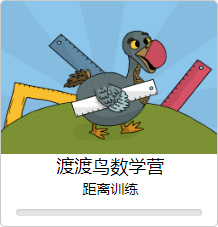 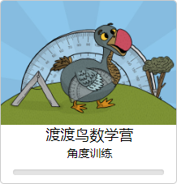 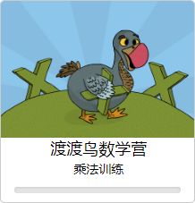 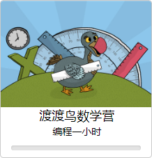 
建议学习编程探险 (Coding adventure)课程一段时间后，可以同时学习渡渡鸟数学营 (Dodo does math)这一系列课程。这样，既能巩固所学到的编程知识，也能复习在学校里学到的数学知识，一举两得。 
### 挑战生成器 (Challenge builder) ###
挑战生成器这一系列课程包含以下几门小课程： 
[img]
在这门课程中，你可以自己创建基于小猴子的游戏，那些在“编程探险 (Coding adventure)”中的老朋友，如乌龟、鳄鱼等卡通形象，此时你都能拿来创建属于你自己的游戏，然后与全世界的用户分享你天马行空的创意。 
### 游戏生成器 (Game builder) ###
这一系列课程包含以下几门小课程： 
[img]
在这门课程中，你可以创建更多场景下的游戏。 
### 香蕉大探险 (Banana tales) ###
香蕉大探险这一系列课程包含以下几门小课程： 
[img]
这一系列课程主要教授Python的基础知识。 
### 聊天机器人编程 (Coding chatbots) ###
这一系列课程同样是用来学习Python的，它包含了以下几门小的课程： 
[img]
通过这一系列课程，你可以编写出一个可以和你聊天的机器人。怎么样，是不是非常酷？ 
## 浏览他人创建的游戏和挑战 ##
点击右上角的“创意区”，在这里，你可以看到其他用户创建的游戏与挑战，当然这些游戏与挑战你也是可以打开并玩的。
